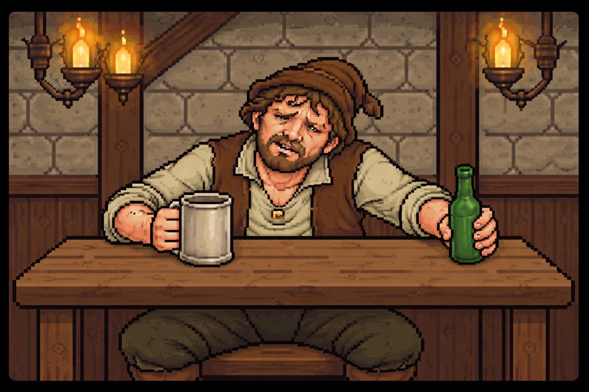
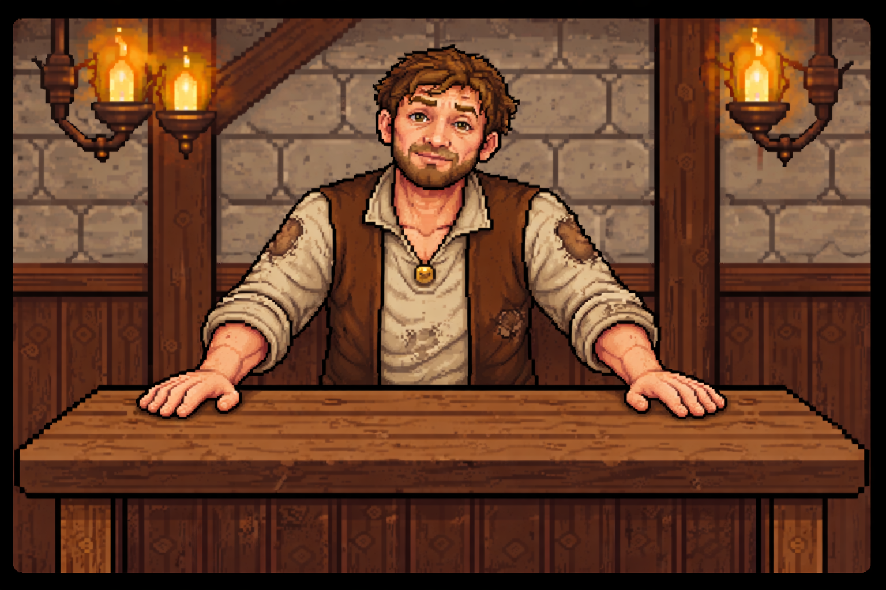
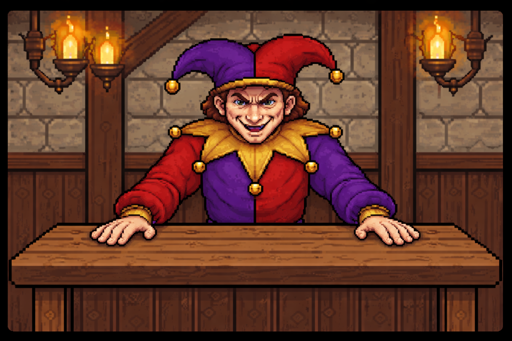
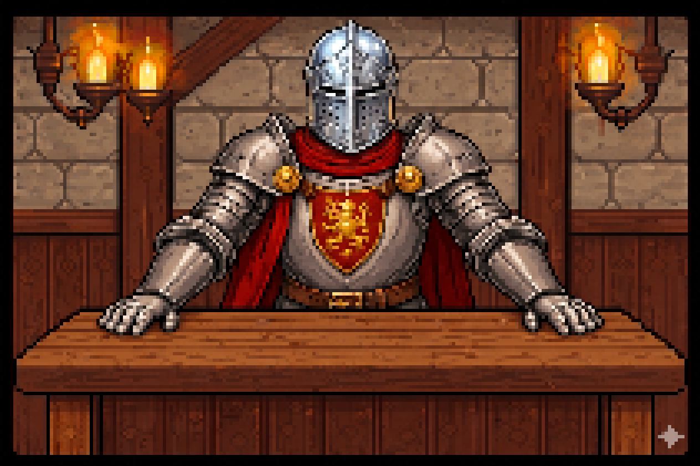
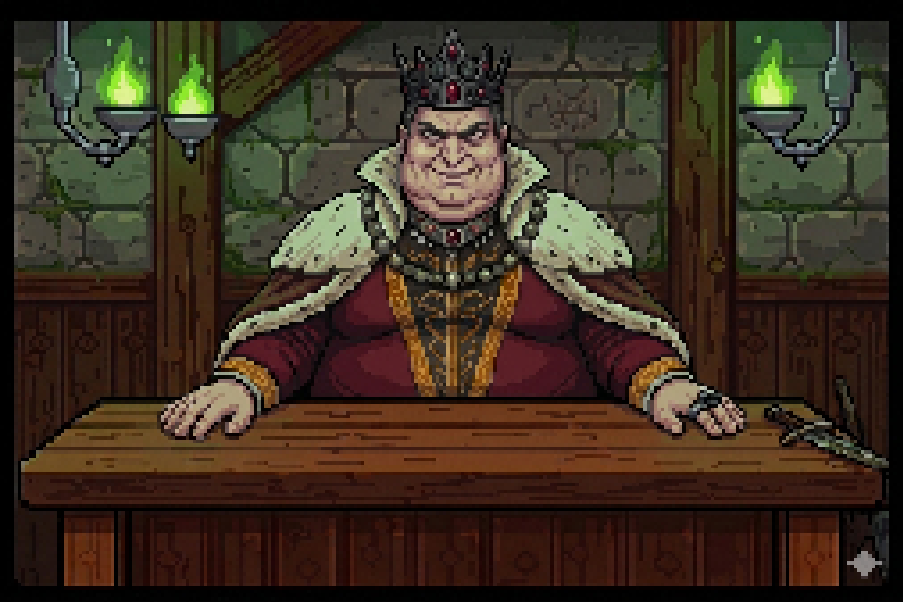
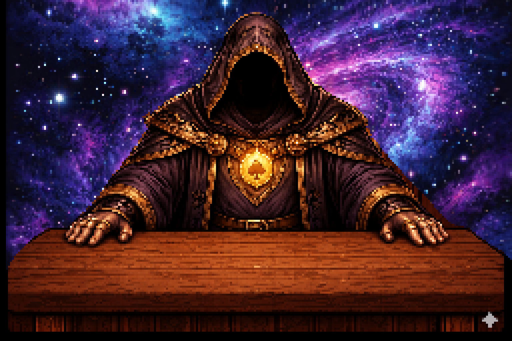

# The Fool´s Descent

---

## _Game Design Document_

**© 2026 Team 7. All rights reserved.**

The following content is owned by its creators. Use without written permission is strictly prohibited.

---

## Authors
- Santiago Aguilar Mello
- Miguel Eduardo Vega Bisonó
- Regina Fernanda Portela Palacios

---

## Teachers
- Esteban Castillo Juárez
- Gilberto Echeverría Furió
- José Ángel Martínez Navarro

---

---

# Index

1. [Index](#index)
2. [Game Design](#game-design)
  1. [Summary](#summary)
  2. [Gameplay](#gameplay)
  3. [Mindset](#mindset)
3. [Technical](#technical)
<!-- Listo hasta aquí / Entrega 1 -->

1. [Screens](#screens)
2. [Controls](#controls)
3. [Mechanics](#mechanics)
4. [Level Design](#level-design)
1. [Themes](#themes)
1. Ambience
2. Objects
1. Ambient
2. Interactive
3. Challenges
2. [Game Flow](#game-flow)
5. [Development](#development)
1. [Abstract Classes](#abstract-classes--components)
2. [Derived Classes](#derived-classes--component-compositions)
6. [Graphics](#graphics)
1. [Style Attributes](#style-attributes)
2. [Graphics Needed](#graphics-needed)
7. [Sounds/Music](#soundsmusic)
1. [Style Attributes](#style-attributes-1)
2. [Sounds Needed](#sounds-needed)
3. [Music Needed](#music-needed)
8. [Schedule](#schedule)

---

# Game Design

## Summary

Not so long ago, there was only The Dealer and the Great Deck. The apparition of the universe, life, love, death and every heartbeat, was shuffled and assigned to the world's spirits and dealt with by a wise, expert who knew what was best for the cycle of life.

Due to an unknown change of events, The Dealer has become bored, cynical and has chosen to change things up. He shuffled the Great Deck and threw its cards like autumn leaves across the mortal plane.

You are The Fool, the only born soul without an assigned future in a dying and chaotic world where fate has become anarchic. To save what remains, you must dive into the unknown, face The Dealer at his own table and gamble the right to exist.

- **Genre:** Trading Card Game, Roguelike
- **Platform:** PC
- **Target Audience:**  Casual Strategy, Roguelike Players - Ages 13+
- **Unique Selling Points:**  Decision-Based Fate System, Dark Humor, Tarot Theme

---

## Gameplay

The Fool's Descent is an indie tabletop roguelike card game in which the player navigates a procedurally generated map and confronts opponents through a system built on tension, gambling, probability and choice. The gameplay takes place at a tarot table, to reinforce the sensation that the player is gambling with their future. On the side lies the Great Deck, the centre of the game, composed of a random number of cards, which include either life or death outcomes, shuffled randomly at the start of each combat. In front of the players we can find their Characters Deck, which functions as their weapons to battle what the Great Deck reveals.

The core loops consists in: Draw card → Manage risk (With your Characters Deck) → Decide target → Resolve effect → Repeat

Managing risk is vital, as the player must choose whether to intervene before deciding the target and committing to the result, using their limited options to alter the future. What sustains engagement is the constant negotiation between fate and control. In this balance, the game ensures that every run feels uncertain, but never unfair, just like life. But remember, each decision contributes meaningfully to the player's descent.

! [GameBoard] ()

### Great Deck

Only two types of cards…

“The Sun provides an opportunity, The Moon changes everything”

“These are not fortunes, they are futures”

#### The Sun
Provides a turn.

Positive fortunes:

- “The Sun stands upright. Life is restored”
- “Light reveals a path forward”
- “The arcana favors you. You remain”
- “Vitality returns under the Sun’s gaze”
- “The light dispels what sought to end you”
- “Your thread holds beneath the Sun”
- “The card speaks of life. You endure”
- “Clarity guides you away from ruin”
- “The Sun grants renewal”
- “Hope rises and so do you”

#### The Moon
The target loses one life.

Negative fortunes:

- “The Moon reveals your end”
- “The arcana turned against you”
- “Illusion fades. The truth is death”
- “The path is lost beneath the Moon”
- “What was hidden now consumes you”
- “Your thread is severed in shadow”
- “The card speaks of endings. You fall”
- “Darkness claims what remains”
- “The Moon obscures all escapes”
- “Fate is sealed under the night”

### Characters Deck Options

#### Common Cards
- *The Magician:* Repeats the effect of the last card played by the character during this combat.
- *The Chariot:* Throws away the top card of the Great Deck. 
- *The Star:* When you reach 0 lives it revives you with a singular extra life.
- *Page of Pentacles:* If you win in the next round it gives you a coin bonus.
- *Strength:* During the next round you cannot die.
- *Two of Pentacles:* Draw two cards from the Great Deck, choose one to use, the other is thrown away.

#### Rare Cards
- *The High Priestess:* Can see the next card from the Great Deck.
- *The Hermit:* Skips your next draw phase entirely. 
- *Justice:* If you lose a life during your next turn, your opponent loses one too.
- *Wheel of Fortune:* Shuffles the Great Deck.
- *King of Pentacles:* If you win the award money doubles, but if you lose the loss money does too.

#### Epic Cards
- *The Lovers:* Permanently remove one moon card from the Great Deck.
- *The Tower:* Randomly destroys 50% of your enemy Characters Deck.
- *The Devil:* You gain two lives BUT It adds one additional moon card to the Great Deck. 
- *The Hanged Man:* Blocks the other player from using their Characters Deck cards during their next turn. 

#### Legendary Cards
- *The Fool:* Randomly applies any of the existing cards, even if they are not in your Characters Deck.

---

# Progression

The player will start with zero cards and money. They must duel a common enemy first in a match with an empty hand.  After this first battle, a procedurally generated map will be shown, where the player must weigh their decisions to what benefits them the most; having a duel or not, facing the boss headfirst or risk a duel beforehand to get more cards and money, prioritize card collection for a next run. If the player dies during a duel, they will lose all of their cards and be able to keep half of their coins.

### Map

### Duel

The duel starts with the cards that were not used last round.
The progression as described in [gameplay](#gameplay) is made in the following manner:

1. The sun and moon cards that will be put on the main deck are shown, shuffled and put face down on the table.
2. The player will be able to choose a card from their character deck.
3. The player must choose the target of the current card on top of the deck; either themselves or the enemy
- If it was a sun card and they choose themselves, they get an extra turn
- If it was a sun card and they choose the enemy
4. Once the target for the current great deck card is shown, the player may get an extra turn or the enemy will get it.
5. The enemy will also get to first use their character deck and then choose the target for the current great deck card.
6. When the great deck runs out of cards, character cards will be given to each side according to the difficulty of the enemy.
7. Repeat

When the Great Deck gets depleted, the they will get more cards in the following manner:
- 2 character cards for common enemies
- 3 for rare
- 4 for epic
- 5 for legendary

Choosing a card from your character deck will discard that card from your hand.

### Items and Currencies
- Coins: Coins can be used at certain points in the map to buy power ups or cards. The player will have the choice of buying it or not. The player wins coins by winning against enemies or by selling cards. 50% of the coins are kept after each reincarnation or replay.
- Cards: 15 cards that help the player manage the risk of moon and sun cards in the main deck.

### Opponents

In order to complete the descent and restore the order of the universe, you must ultimately confront and defeat The Dealer. Because the map is generated randomly for every attempt, the path ahead is never certain. Each victory you claim along the way serves a vital purpose beyond mere survival, as defeating enemies is the primary way to obtain the more powerful cards and precious coins required to afford life. While it may be tempting to avoid conflict to preserve your health in the short term, doing so will eventually leave you under-equipped, forced to rely solely on your faith in the future.

On the map, one of the enemies of each difficulty will appear, those are also randomly selected, ensuring that no journey is ever the same. The options appear below.

#### Common Enemies

- "Drunk"

- "Peasant"

These characters lack any real combat training, they only manage to play a basic common card every other turn, giving you plenty of time to find your footing.

#### Rare Enemies:

- "Crazy Jester"

- "Bounded Knight"

These are a bit more seasoned but still have their openings. While they’ve added some rare cards to their deck, they aren't perfectly consistent, they’ll skip an action every third turn, offering you a brief window to strike back.

#### Epic Enemies:

- "Killer Queen"

- "Mad Monarch"

These are relentless fighters who never miss a beat, playing a card every single turn. Their decks are packed with epic cards, meaning you’ll need to stay sharp just to keep up with their constant pressure.

#### Legendary and Final Enemy:

- "The Dealer"

He doesn’t just play the game, he MAKES it. Holding the only Legendary card in existence, he’s capable of overwhelming you by dropping two cards at once every few turns. To beat him, you’ll have to survive a level of aggression unlike anything else you have seen before.

## Mindset

The mindset this game should evoke on the players should be uncertainty and adventure, with a hint of dark humour. This mindset will be created by the medieval/magical visuals and the eerie and mysterious music. The style and story add to the ambiance that will make the game memorable from the start

At first, the sense of chance is big, but after the first round of the first duel, each character card will introduce slowly the idea of planning and thinking before playing their cards to the player. This will let the player slowly understand the slight gambling element, while introducing the ways in which they could save themselves and punish the enemy, and vice versa from the enemy's side.

Since you are "The Fool", the world must feel unknown, amusing and dreadful all at once, where the player does not know all cards, but after every victory and defeat the player will get a lesson about how the character cards, world, and map works.

# Technical
<!-- Listo hasta aquí / Entrega 1 -->

## Screens

### Main Screen
Buttons: [New Descent], [Options], [Exit]

### Level Selection
Graph map with nodes:
- Battle
- Boss
- Mystery
- Rest

### Duel
- 10 card slots
- Shared deck

### Upgrade
Buttons: [Exit], [Accept]

---

## UI / UX

### Questions
- Is the information clear?
- Can players understand the game instantly?
- Is feedback strong enough?

---

## Controls

Mouse: drag cards
Keyboard: ESC, SPACE

---

## Mechanics

### Duel Mechanics
Each player has 3 lives

### Prophecy Deck
- Deck Size: `S = base + random(0,2)`
- Moon cards: random distribution

### Effects
- Moon: damage
- Sun: extra turn

### Questions
- Is randomness fair?
- Can players predict outcomes?

---

# Art Direction

### Questions
- What visual style defines the game?
- How do the Sun and Moon differ visually?

---

# Sound Design

### Questions
- What sounds signal danger?
- Does music increase tension?

---

# Level Design

### Questions
- Are choices meaningful?
- Can players plan routes?

---

# Schedule

### Milestones
- Prototype
- Alpha
- Beta

### Questions
- What is the next step?
- What is the biggest risk?

