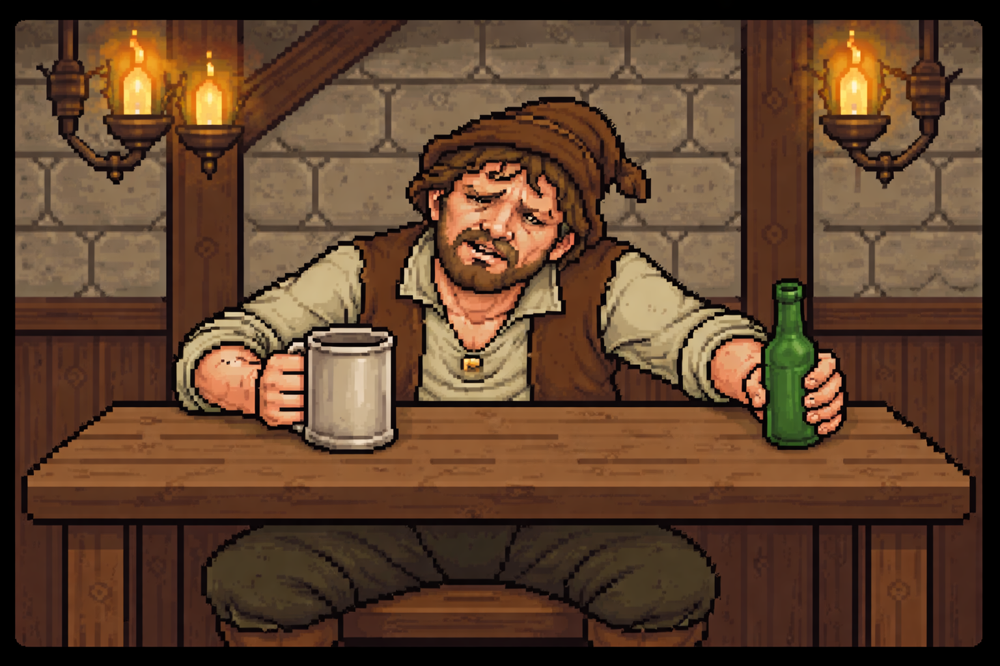
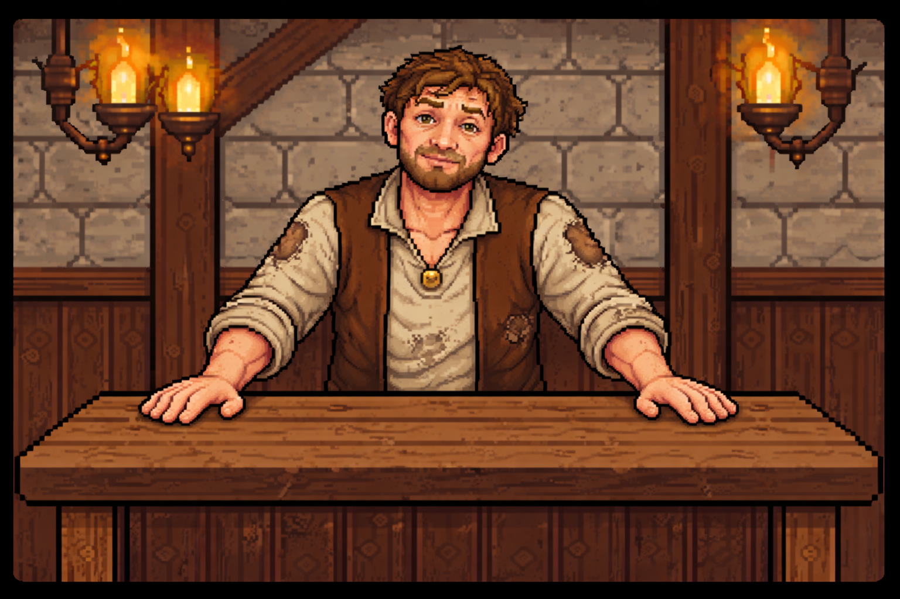
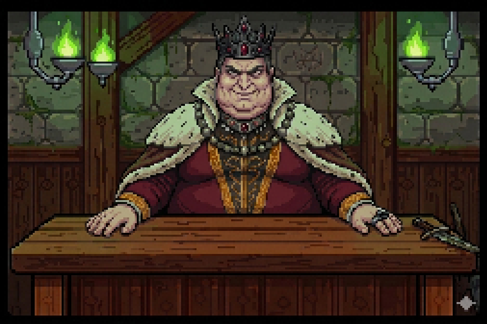

# The Fool´s Descent

---

## _Game Design Document_

**© 2026 Arcana Studios. All rights reserved.**

The following content is owned by its creators. Use without written permission is strictly prohibited.

---

## Authors
- Santiago Aguilar Mello
- Miguel Eduardo Vega Bisonó
- Regina Fernanda Portela Palacios

---

## Teachers
- Esteban Castillo Juárez
- Gilberto Echeverría Furió
- José Ángel Martínez Navarro

---

---

# Index

1. [Index](#index)
2. [Game Design](#game-design)
    1. [Summary](#summary)
    2. [Gameplay](#gameplay)
        1. [Great Deck](#great-deck)
            - [The Sun](#the-sun)
            - [The Moon](#the-moon)
        2. [Characters Deck Options](#characters-deck-options)
            - [Common Cards](#common-cards)
            - [Rare Cards](#rare-cards)
            - [Epic Cards](#epic-cards)
            - [Legendary Cards](#legendary-cards)
    3. [Mindset](#mindset)
3. [Progression](#progression)
    1. [Map](#map)
        - [Upgrades](#upgrades)
4. [Duel](#duel)
5. [Items and Currencies](#items-and-currencies)
6. [Opponents](#opponents)
    1. [Common Enemies](#common-enemies)
    2. [Rare Enemies](#rare-enemies)
    3. [Epic Enemies](#epic-enemies)
    4. [Legendary and Final Enemy](#legendary-and-final-enemy)
7. [Technical](#technical)
    1. [Screens](#screens)
    2. [Controls](#controls)
    3. [Mechanics](#mechanics)
        - [Duel Mechanics](#duel-mechanics)
        - [Prophecy Deck](#prophecy-deck)
        - [Effects](#effects)
        - [Upgrade](#upgrade)
        - [Health System](#health-system)
    4. [UI / UX](#ui--ux)
    5. [Statistics](#statistics)
    6. [Data Collection](#data-collection)
8. [Development](#development)
    1. [Abstract Classes](#abstract-classes--components)
    2. [Derived Classes](#derived-classes--component-compositions)
9. [Art Direction](#art-direction)
    1. [Themes](#themes)
    2. [Visual References](#visual-references)
    3. [Movement](#movement)
    4. [Animation](#animation)
    5. [Colors](#colors)
    6. [Enemy Design](#enemy-design)
    7. [Cards](#cards)
    8. [Sound Design](#sound-design)
    9. [Level Design](#level-design)
10. [Schedule](#schedule)

---

# Game Design

## Summary

Not so long ago, there was only [The Dealer](#summary) and the [Great Deck](#great-deck). The apparition of the universe, life, love, death and every heartbeat, was shuffled and assigned to the world's spirits and dealt with by a wise, expert who knew what was best for the cycle of life.

Due to an unknown change of events, [The Dealer](#summary) has become bored, cynical and has chosen to change things up. He shuffled the [Great Deck](#great-deck) and threw its cards like autumn leaves across the mortal plane.

You are [The Fool](#summary), the only born soul without an assigned future in a dying and chaotic world where fate has become anarchic. To save what remains, you must dive into the unknown, face [The Dealer](#summary) at his own table and gamble the right to exist.

- **Genre:** Trading Card Game, Roguelike
- **Platform:** PC
- **Target Audience:**  Casual Strategy, Roguelike Players - Ages 13+
- **Unique Selling Points:**  Decision-Based Fate System, Dark Humor, Tarot Theme

---

## Gameplay

The Fool's Descent is an indie tabletop roguelike card game in which the player navigates a procedurally generated [map](#map) and confronts opponents through a system built on tension, gambling, probability and choice. The gameplay takes place at a tarot table, to reinforce the sensation that the player is gambling with their future. On the side lies the [Great Deck](#great-deck), the centre of the game, composed of a random number of cards, which include either life or death outcomes, shuffled randomly at the start of each combat. In front of the players we can find their [Characters Deck](#characters-deck-options), which functions as their weapons to battle what the Great Deck reveals.

The core loops consists in: Draw card → Manage risk (With your [Characters Deck](#characters-deck-options)) → Decide target → Resolve effect → Repeat

Managing risk is vital, as the player must choose whether to intervene before deciding the target and committing to the result, using their limited options to alter the future. What sustains engagement is the constant negotiation between fate and control. In this balance, the game ensures that every run feels uncertain, but never unfair, just like life. But remember, each decision contributes meaningfully to the player's descent.

### Great Deck

Only two types of cards…

“The Sun provides an opportunity, The Moon changes everything”

“These are not fortunes, they are futures”

#### The Sun
Provides a turn.

Positive fortunes:

- “The Sun stands upright. Life is restored”
- “Light reveals a path forward”
- “The arcana favors you. You remain”
- “Vitality returns under the Sun’s gaze”
- “The light dispels what sought to end you”
- “Your thread holds beneath the Sun”
- “The card speaks of life. You endure”
- “Clarity guides you away from ruin”
- “The Sun grants renewal”
- “Hope rises and so do you”

#### The Moon
The target loses one life.

Negative fortunes:

- “The Moon reveals your end”
- “The arcana turned against you”
- “Illusion fades. The truth is death”
- “The path is lost beneath the Moon”
- “What was hidden now consumes you”
- “Your thread is severed in shadow”
- “The card speaks of endings. You fall”
- “Darkness claims what remains”
- “The Moon obscures all escapes”
- “Fate is sealed under the night”

### Characters Deck Options

#### Common Cards
- *The Magician:* Repeats the effect of the last card played by the character during this combat.
-- *The Chariot:* Throws away the top card of the [Great Deck](#great-deck). 
- *The Star:* When you reach 0 lives it revives you with a singular extra life.
- *Page of Pentacles:* If you win in the next round it gives you a coin bonus.
- *Strength:* During the next round you cannot die.
-- *Two of Pentacles:* Draw two cards from the [Great Deck](#great-deck), choose one to use, the other is thrown away.

#### Rare Cards
- *The High Priestess:* Can see the next card from the [Great Deck](#great-deck).
- *The Hermit:* Skips your next draw phase entirely. 
- *Justice:* If you lose a life during your next turn, your opponent loses one too.
-- *Wheel of Fortune:* Shuffles the [Great Deck](#great-deck).
- *King of Pentacles:* If you win the award money doubles, but if you lose the loss money does too.

#### Epic Cards
-- *The Lovers:* Permanently remove one [moon card](#the-moon) from the [Great Deck](#great-deck).
-- *The Tower:* Randomly destroys 50% of your enemy [Characters Deck](#characters-deck-options).
-- *The Devil:* You gain two lives BUT It adds one additional [moon card](#the-moon) to the [Great Deck](#great-deck). 
- *The Hanged Man:* Blocks the other player from using their Characters Deck cards during their next turn. 

#### Legendary Cards
-- *The Fool:* Randomly applies any of the existing cards, even if they are not in your [Characters Deck](#characters-deck-options).

---

# Progression

The player will start with zero cards and money. They must [duel](#duel) a common enemy first in a match with an empty hand.  After this first battle, a procedurally generated [map](#map) will be shown, where the player must weigh their decisions to what benefits them the most; having a duel or not, facing the boss headfirst or risk a duel beforehand to get more cards and money and prioritize card collection for a next run. If the player dies during a duel, they will lose all of their cards but be able to keep half of their coins.

## Map
The map will be a procedurally generated directed graph, similar to the one used in *Slay the Spire*, but stylized to match the pixelated tarot style.

1. **Nodes:** Each node will include an enemy, upgrade or rest site
    - *Enemy:* Refer to the [enemy specifications](#opponents)
    - *Upgrade:* Refer to the [upgrade specifications](#upgrades)
    - *Rest:* Similar to Monopoly rest stops, they do nothing, but give the player time to rethink their strategy.
2.  **Paths:** The player will start from the far left, advancing towards the right.

The encounters will be easier on the beginning, where a calculation to prioritize easier enemies will be made. However, the possibility of finding a hard enemy or even the boss at the beginning is never zero.

#### Upgrades
- *Card Binding* (300 coins): Spend a high amount of coins in order to be able to "bound" a card. This will make the card return to your hand on the next duel even if it was used on the last one.

- *Life Extension* (400 coins): Increase the maximum life, where the baseline starts at 3.

- *Card* (100 coins): The player may purchase one random card to use in their next duel.

## Duel

The duel starts with the cards that were not used on last round.
The progression as described in [gameplay](#gameplay) is made in the following manner:

1. The [sun](#the-sun) and [moon](#the-moon) cards that will be put on the [main deck](#great-deck) are shown, shuffled and the put face down on the table.
2. The player will be able to choose a card from their [Characters Deck](#characters-deck-options).
3. The player must choose the target of the current card on top of the deck; either themselves or the enemy.
    - If it was a sun card and they chose themselves, they get an extra turn.
    - If it was a sun card and they chose the enemy, nothing happens. This is not purposeful, but rather what the player wants to avoid during the gameplay.
    - If it was a moon card the target loses a life.
5. The enemy repeats the process.
7. Repeat.

When the [Great Deck](#great-deck) gets depleted, duel participants will get more character cards in the following manner:
- 2 for common enemies
- 3 for rare enemies
- 4 for epic enemies
- 5 for legendary enemies

Choosing a card from your character deck will discard it from your hand.

## Items and Currencies
- *Coins:* Coins are gained at the end of a duel, granting 100 per victory. They may be used at certain points in the map to buy powerups or cards. The player will have the choice of buying it or not. 50% of the coins are kept after each reincarnation.
- *Cards:* 16 cards that help the player manage the risk of [moon](#the-moon) and [sun](#the-sun) cards in the [main deck](#great-deck) during [duels](#duel).

## Opponents

In order to complete the descent and restore the order of the universe, you must ultimately confront and defeat [The Dealer](#summary). Because the [map](#map) is generated randomly for every attempt, the path ahead is never certain. Each victory you claim along the way serves a vital purpose beyond mere survival, as defeating enemies is the primary way to obtain the more powerful cards and precious coins required to afford life. While it may be tempting to avoid conflict to preserve your health in the short term, doing so will eventually leave you under-equipped, forced to rely solely on your faith in the future.

On the map, one of the enemies of each difficulty will appear, those are also randomly selected, ensuring that no journey is ever the same. The options appear below.

#### Common Enemies

- "Drunk"

- "Peasant"

These characters lack any real combat training, they only manage to play a basic common card every other turn, giving you plenty of time to find your footing.

#### Rare Enemies:

- "Crazy Jester"

Cards Included: The Magician, The Chariot.

- "Bounded Knight"

Cards Included: The Star, Page of Pentacles.

These are a bit more seasoned but still have their openings. While they’ve added some rare cards to their deck, they aren't perfectly consistent, they’ll skip an action every third turn, offering you a brief window to strike back.

#### Epic Enemies:

- "Killer Queen"

Cards Included: Strength, Two of Pentacles, The High Priestess, The Hermit.

- "Mad Monarch"

Cards Included: Justice, Wheel of Fortune, King of Pentacles.

These are relentless fighters who never miss a beat, playing a card every single turn. Their decks are packed with epic cards, meaning you’ll need to stay sharp just to keep up with their constant pressure.

#### Legendary and Final Enemy:

- "The Dealer"

Cards Included: The Lovers, The Tower, The Devil, The Hanged Man

He doesn’t just play the game, he MAKES it. Holding the only Legendary card in existence, he’s capable of overwhelming you by dropping two cards at once every few turns. To beat him, you’ll have to survive a level of aggression unlike anything else you have seen before.

## Mindset

The mindset this game should evoke on the players should be uncertainty and adventure, with a hint of dark humour. This mindset will be created by the medieval/magical visuals and the eerie and mysterious music. The style and story add to the ambiance that will make the game memorable from the beginning.

At first, the sense of chance is big, but after the first round of the first duel, each character card will introduce slowly the idea of planning and thinking before playing their cards to the player. This will let the player slowly understand the slight gambling element, while introducing the ways in which they could save themselves and punish the enemy, and viceversa from the enemy's side.

Since you are "The Fool", the world must feel unknown, amusing and dreadful all at once, where the player does not know all cards, but after every victory and defeat the player will get a lesson about how the character cards, world, and map works.

---

# Technical

The key screens will be carefully selected and designed in order to enhance the user experience, focusing on a clear and understandable visuals, artstyles and colors that match the style and atmosphere of the game, such as the following:

## Screens

### Main Screen
Buttons: 

[New Descent]: Will start a new game, deleting and starting from zero but with the money collected, cards kept
and upgrades already bought.
[Continue Descent]: Will retreive all data from the database; Runs, perks, cards saved, position within the node and enemies defeated.

[Statistics]: Will display the statistics collected through the single plays and global plays. for more information, consult the statistics section.

 

### Level Selection

Graph map with nodes:

- **Battle**: Will start the duel with an enemy. It can be described off as the following

-  **Boss**: The boss will be shown based off the l finalize the game when the battle is won

-  **Mystery**: Here the player will be given a random choice out of three possibilities; Card Binding, Life extension or an extra C.ard. for more info, refer to upgrades

-  **Rest:** The player will just be fiven a free node to move more freely. Standing on it will not do anything.

  
  

### Controls

- 10 card slots for character cards: The player will be able to hover over them do see their info, and click on them to choose the current card

- Shared deck: Includes sun and moon cards. These will be facing down and the only thing the player will be able to do is clicking on it.

- Target screen: The player will be given a choice wether the current card selected applies to the enemy or themselves.

  

## Mechanics

### Duel Mechanics
Each player has 3 lives. When a participant reaches 0 lives, they will lose the game. The player will start with 0 character cards and will be added after the great deck has been depleted and given the enemy difficulty. The player is first able to see the total amount of sun and moon cards on the main deck before being shuffled and placed down, then they will be given the opportunity to choose from their character deck (if there is no cards on the character deck, this step is skipped). Then they will have to choose the target of the curret card on top of the main deck. I can be either themselves or the enemy. The effects of the card will be revealed after an animation of it being placed on the crystal ball and its result will be revealed after said animation. After the effects are applied, the enemy will do the same.

Steps:

1. Show main deck contents (sun/moon counts).
2. Shuffle the main deck and place it face-down on the table.
3. Choose a character card from your hand (if available).
4. Choose the target for the current top card (self or enemy).
5. Apply the top card's effect.
6. Enemy's turn: they follow the same sequence.
7. Repeat until one duelist reaches 0 lives.
 

### Prophecy Deck
- Deck Size: `S = base + random(0,2)`
- Moon cards: `random distribution 'M = random(1, S-1)`

### Effects
- Moon: damage
- Sun: Provides a turn

### Up Removes a life
A text offering to provide an upgrade from buttons: 
- [Exit Upgrade]: The offer will be rejected and the window will be closed so the player can move to another node.
- [Accept & pay]: The amount of money asked will be withdrawn from the player and they will be given the [upgrade](#upgrades).

### Health System
The health system is represented by candles, where a candle will melt in three sections to represent each base life. When the candle is completely melted, the player has lost all of their lives and thus the game, prompting them to start a new run. If a health upgrade is accepted, a second candle will be added proportional to the HP increase, still divided in 3 sections. When the extra candle runs out, the original one will start melting.

`Health = 3 * candles + (3 - current candle section)`

---

## UI / UX
The user interface and experience design is focused on malong it simple, intuitive, yet inmersive into the game. This is because our intention is for the player to feel like they are the ones sitting at the fortune table and traveling along this universe. The interface must integrate well with our world building and should also avoid breaking the mystical yet comical atmosphere that is being built.

### Visual Interface
- Duel (The Table): The screen does not have a clear health bar, but rather lives represented by melting candles. This is inspired from *Ghosts of Tsushima*, where game elements like HP, stamina, guidance maps are mixed onto the very atmosphere of the game represented with elements within the game's nature. The cards will be placed in an intuitive manner in front of the player, and the elements such as character cards and the great deck will be highlighted when the mouse hovers them in order to describe the elements efficiently
- Character Deck: positioned at the bottom of the screen, cards will elevate and show a brief description of their effects as described in [the character deck](#Characters-Deck-Options). The player will be able to click to select the card and then choose the target.
- The Great Deck: positioned at the center left of the table, it will initially display its contents of sun and moon cards every time a new round is started, then it will be suffled and only display the top card facing down. The player will be able to hover their mouse over it, highlighting but yet not showing its contents in order to higlight the mystical aspect of the game. To choose its target, the player will click the card and choose the target, which will be diisplayed by a simple text asking "Apply to:[Enemy] on the top, and [Yourself] on the bottom".
- Targeting screen: When the player clicks on the great deck, a simple text asking "Apply to:[Enemy] on the top, and [Yourself] on the bottom".
- Map: The map will be a graph with nodes, within this graph, the player will only be able to click on those nodes adjacent to their current position. Each node will vary as stated in [the map section](#map), and will be represented by a black square for bosses, gears for their upgrades,a portal to represent the rest site, and finally a castle to represent the bossfight.
- Upgrade screen: a small window over the map will pop with the offer to upgrade in exchange of coins. The player will be able to click on the [Accept & Pay] button to accept the offer and pay the coins, or click on the [Exit Upgrade] button to reject the offer and close the window.
- Statistics Screen: From the main menu, the player will access and view the statistics screen
[!Statistics Screen](Statistics.png)
 - Duel Closure: When the player wins or loses the game, a window will pop up, showing the result of the game, providing a description of the results and giving a small text of the money earned to increase the dopamine of the game. The player will be able to click an [Return] button to return to the map for the next enemy.

---

## Statistics

The game will include a statistics system designed to track both individual player performance and global trends across all players. This system serves two main purposes: first, to give players a sense of progression and reflection over their runs, and second, to provide useful data that can help evaluate balance and player behavior over time. They will be divided into two main categories:

### Personal Statistics

- Total Play Time
- Deaths
- Enemies Defeated
- Victories
- Coins Earned
- Cards Played

 

### Global Statistics

- Total Number of Players
- Average Play Time
- Average Deaths
- Total Enemies Defeated
- Average Victories
- Total Coins Earned
- Total Cards Played

## Data Collection

The game will run on a web-based structure using HTML for layout, CSS for styling, and JavaScript for logic. The statistics will be collected in real time through JavaScript by tracking key gameplay events. Each time a relevant action occurs, such as starting or ending a run, winning or losing a duel, defeating an enemy, playing a card or gaining coins, JavaScript updates internal counters stored in variables or objects. For example, every time a player uses a card, a counter like cardsPlayed++ is updated instantly during gameplay. At the end of a session or at defined checkpoints, this data is sent to a backend using requests, allowing it to be stored in a SQL database. To support long term progression, the system will include a login feature, so the players can leave the game and return later without losing progress. 

The database structure will include:

- **Users Table:** Stores login credentials and a unique player ID.
- **Player Statistics Table:** Stores individual data such as play time, deaths, victories, coins, and cards used.
- **Global Statistics Table:** Stores aggregated values across all players.
- **Game State Table:** Stores the player’s current run, including:
    - Current position on the map
    - Current deck (cards owned and remaining)

When data is received player statistics are updated using the player’s ID, the current game state is saved, so the player can resume later and global statistics are updated to reflect overall activity.

### Main Menu Integration

From the main menu, players will have access to both “Statistics” and a “Continue Descent” option. When selecting "Statistics" JavaScript requests data from the backend, the server retrieves the stored SQL data and the information is displayed using HTML. The interface will separate Personal and Global ones. When selecting "Continue Descent" the system loads the saved game state from the database and the player resumes exactly where they left off, including map position, deck, and resources.

---
# Development

The tentative classes with the necessary methods to program the game are the following: 

## Abstract Classes 

    class Card {
        String name;
        public Card(String name) {
            this.name = name;
        }
        abstract void applyEffect(Game game, Entity source, Entity target);
    }

    class Entity {
        int lives;
        void loseLife() {
            lives--;
        }
        void gainLife() {
            lives++;
        }
        void revive() {
            lives = 1;
        }
    }

    class Deck {
        Card[] cards;
    }

    class Game {
        MainDeck mainDeck;
        void extraTurn(Entity e) {}
        void repeatEffect() {}
        void discardMainDeck() {}
        void addMoon() {}
        void randomEffect() {}
    }

## Derived Classes

    class MainDeckCard extends Card {
        public MainDeckCard(String name) {
            super(name);
        }
    }

    class Sun extends MainDeckCard {
        public Sun() {
            super("Sun");
        }
        void applyEffect(Game game, Entity source, Entity target) {
            game.extraTurn(source);
        }
    }
// Needs to be repeated for the Moon Card

    class CharacterCard extends Card {
        public CharacterCard(String name) {
            super(name);
        }
    }

    class Magician extends CharacterCard {
        public Magician() {
            super("Magician");
        }
        void applyEffect(Game game, Entity source, Entity target) {
            game.repeatEffect();
        }
    }
// One per character

    class Player extends Entity {
    }
// The same for enemy

    class MainDeck extends Deck {
    }
// Applies to the Characters Deck too

# Art Direction

## Themes
The main art design in this game is Pixel Art. The cards use a cleaner and simpler pixel art style to maintain readability during gameplay, while the map and enemy designs use more detailed pixel art to create stronger atmosphere, personality, and immersion. The whole game will have themes of mystery, medieval ages and mystical and tarot references all over. Some examples include symbols in the map and the backgrounds. 

## Visual References
The visual style of the game takes inspiration from games such as Inscryption for its dark card table atmosphere. Traditional tarot illustrations and medieval themes also serve as artistic references, helping reinforce the mystical and symbolic aesthetic of the world.

## Movement
The main visual movements in the game are designed to reinforce its mystical and ominous tone while keeping interactions clear and satisfying. As the player progresses, The Fool will move smoothly across the map from node to node, emphasizing the sense of journey and descent into the unknown. During duels, cards will respond dynamically to player input by slightly elevating and rotating when selected or hovered over, creating a tactile and responsive feel that highlights their importance in decision making. Additionally, when a Moon card is applied to either the player or the enemy, a dark, magical mist will emerge from the crystal ball at the center of the table, spreading subtly across the scene to visually represent the shift toward danger and the presence of an unfavorable fate.

## Animation
The enemies will have three animation frames combined into a looping GIF to give them movement and personality during duels. These subtle animations help make each opponent feel more alive and reinforce their individual presence at the table. In addition, each enemy will have a final defeat frame, where they are shown resting their head on the table, visually representing their loss.

 

The candle that represents the player’s lives will also be animated using three frames combined into a seamless looping GIF. Since the candle is both a gameplay mechanic and an important source of light on the dark table, its constant flame helps maintain the atmosphere of tension and uncertainty, especially during the second half of the game where the environment becomes darker and more oppressive.

## Colors
At the beginning of the game, the visual palette uses warmer colors to represent hope, curiosity, and the sense of adventure that comes with starting a new descent. Easy and mid-difficulty enemies are designed with warmer tones and softer backgrounds, creating a feeling of familiarity and false security. During this first half of the game, the music also reflects this atmosphere by being more adventurous, mystical, and slightly optimistic.

As the player progresses deeper into the descent, the tone of the game becomes more serious and unsettling. The second half introduces a darker color palette, with colder shadows, stronger contrasts, and more oppressive environments. High-difficulty enemies and the final boss use darker tones to emphasize danger, tension, and uncertainty. The music also shifts to become more intense, eerie, and suspenseful. This transition helps communicate that the journey is no longer about simple exploration, but about surviving fate itself, creating a stronger sense of pressure without turning the experience into pure horror.

The playing table uses deep purple, dark blue and silver tones to create a mystical and ominous atmosphere, making each duel feel more like a fortune telling ritual than a traditional battle. Elements such as candles, shadows, tarot symbols, and the crystal ball reinforce the idea that the player is not simply playing cards, but confronting fate itself. This darker and more elegant color palette helps build tension and mystery, while also making the brighter Sun cards stand out more clearly whenever moments of hope appear.

## Enemy Design

Each enemy is designed with a clear silhouette and visual personality so that players can immediately recognize their role and difficulty. Easier enemies such as the Drunk and the Peasant have simpler clothing, warmer colors, and more relaxed or clumsy postures, making them feel less threatening. Mid-difficulty enemies like the Crazy Jester and the Bounded Knight have stronger visual contrast, with sharper shapes, exaggerated expressions, and more detailed outfits that reflect instability or discipline.

High-difficulty enemies such as the Killer Queen and the Mad Monarch use darker palettes, stronger posture, and more imposing silhouettes to communicate authority and danger. The Dealer is designed to feel elegant, calm and unsettling. His posture is controlled, and his visual presence should immediately make the player feel that they are facing the creator of fate itself, a force rather than another enemy.

## Cards
The Sun and Moon cards are designed as complete visual opposites, reinforcing their role as the core symbols of fate in the game. Sun cards represent hope, fortune, relief, clarity, and good luck. Their color palette uses warm tones such as gold, yellow, ivory, and soft orange to create a feeling of safety and optimism. These cards are meant to feel inviting and reassuring, giving the player a brief sense of control and comfort.

In contrast, Moon cards represent misfortune, uncertainty, danger, death, and the loss of control. Their visual design is intentionally darker and more ominous, using deep blues, purples, black tones, and silver accents to create a cold and foreboding atmosphere. While Sun cards feel bright and hopeful, Moon cards should immediately communicate tension and fear. This strong visual contrast helps the player instantly recognize whether fate is working in their favor or against them.

The character cards use a more varied color palette, as each one represents a different fate, power, or form of intervention against destiny. Unlike the Sun and Moon cards, which follow strict visual opposites, these cards are designed with greater visual diversity to reflect their unique effects and personalities.

The cards themselves do not include strong visual indicators to distinguish whether they are Common, Rare, or Epic. This is intentional, as the design philosophy is that power should not be immediately obvious through appearance alone. A card may look simple or harmless, but its true value is revealed through its effect during gameplay. Instead of relying on flashy visuals to communicate strength, the power of each card is meant to speak for itself through the decisions it creates and the impact it has on the duel.

---

## Sound Design

The following audio files will be featured all throughout the game, during the specified moments:

### Music

- Home Screen Music: https://drive.google.com/file/d/1urB5jivarNT5OWPFKnxyvBQH10WPmeLW/view

- Map Music: https://drive.google.com/file/d/1MwSLkbPEPxqgpSPwxPaChh18HQwx9kr6/view

- Common Enemy Music: https://drive.google.com/file/d/1jQaZSr_DPYjfQTAnrEwHa09czris5vCH/view

- Rare Enemy Music: https://drive.google.com/file/d/18ZpjLBF9V656dGaQgPunKcfh6cbkQpkr/view

- Epic Enemy Music: https://drive.google.com/file/d/1urB5jivarNT5OWPFKnxyvBQH10WPmeLW/view

- Final Boss Music: https://drive.google.com/file/d/1j0HN8uPZ_J-cHGiEnDhUq5tODtyQQd4B/view

- Final Boss Speech: https://drive.google.com/file/d/1GGLNlT3SoiWu1vCBj7GiiSaMB4mXp3aS/view

### Sound effects

- Grabbing / Placing Card: https://drive.google.com/file/d/1W85aqtEAbrDJ4l1WqGxttxixxZnJmJUO/view

- Candle Burning / Losing the Last Life: https://drive.google.com/file/d/1ou-ub_bsTDPM1OJGACr0HsuA9zkukDk8/view

- Temporary Music when on Last Life (to add tension): https://drive.google.com/file/d/1ST9hems4tOUkqzwvmLZwmD1odB6efiC0/view

- Enemy Defeated: https://drive.google.com/file/d/1KoQGm-IornHsb8N3QEXILYH8KixAg8Zb/view

- Enemy Textbox: https://drive.google.com/file/d/1i8WX0EGKbFcRM_nzs5VeQxpbuPQBxVil/view

- Enemy "Talking": https://drive.google.com/file/d/1YFMdREcwwZ2eImFIjvnNkncWK1T1NlTC/view

---

## Level Design

As said before, the levels will be procedurally generated with a graph. each node, as described in screens will include the following types:

- Battle: Will start the duel with an enemy. It can be described off as the following
- Boss: The boss will be shown based off the same formula as enemies, however, it will finalize the game when the battle is won
- Mystery: Here the player will be given a random choice out of three possibilities. The possibilities will be generated by the help of the aforementioned array for the map, and then we will have an array including each possibility for the upgrade, which will be shuffled and poped on each upgrade node. The three possibilities will be Card Binding, Life extension or an extra Card. for more info, refer to upgrades
- Rest: The player will regain their HP lost after a battle
Each time the graph will be generated, it must have 8 nodes total, consisting of 4 enemies (including the boss), 3 upgrades and a single rest node. The structure for the node selection be a a Undirected Connected Graph, where each node will be calculated with the a pool defined as ‘[Enemy, Enemy, Enemy, Upgrade, Upgrade, Upgrade, Rest] and will be shuffled. The first node will be chosen as the start of the game. the next node will be connected to a random node already in the web. This will be repeated until all 8 nodes are connected.

With this procedure, we can guarantee that all nodes were randomly generated and connected, allowing the player to face all possibilities within the game. However, the type of enemies have not been defined yet. This will be calculated based off their height within the graph. This will be made with the help of probabilities. 

First Fight
- Common Chance: 100%
- Rare Chance: 0%
- Epic Chance: 0%
- Boss: 0%

Second Fight:
- Common Chance: 20%
- Rare Chance: 80%
- Epic Chance:  0%
- Boss: 0%

Third Fight:
- Common Chance: 0%
- Rare Chance: 40%
- Epic Chance: 60%
- Boss: 0%

Fourth Fight (Boss Fight):
- Common Chance: 0%
- Rare Chance: 0%
- Epic Chance: 0%
- Boss: 100%

This will guarantee that the game will gradually increase depending on the progress of the player within the game, guaranteeing that it will be adapting to the difficulty and will add fun to the game. 

With these increasing probabilities, the risk increases gradually, prompting the player to prioritize focusing on improving for the next run or facing the boss directly if the player feels ready enough with their upgrades. And will be able to plan ahead their movements and wether they want to keep their cards for the next battle or use it now to manage risks.

---

# Schedule

The idea is to start with a simple but functional prototype and gradually build up complexity, adding systems, content, and polish along the way. Each milestone is meant to represent a stable version that can be tested and improved, so progress stays consistent and manageable. By the end of the five weeks, the goal is to have a complete and polished version ready for delivery.

- **Week 1**
    - Core Sun/Moon mechanics implemented
    - Basic gameplay loop functional in console
    - Initial testing of core interactions

- **Week 2**
    - Basic art implementation
    - Character deck system functional
    - Map integration working
    - Playable but still rough experience

- **Week 3**
    - Refinement of core systems
    - Additional cards and mechanics implemented
    - Improved UI clarity and feedback
    - Early balancing pass

- **Week 4**
    - Sound effects integration
    - Enemy balancing
    - 100% of cards implemented
    - Stable gameplay experience with minor bugs

- **Week 5**
    - Bug fixing and optimization
    - Visual polish and consistency improvements
    - Final testing and adjustments
    - Final delivery version ready

Once this schedule is completed, the next step would be to gather feedback through playtesting and evaluate how the game performs in practice, using those insights to refine mechanics, adjust balance, and decide whether additional content or improvements are needed. At the same time we need to be careful, because the biggest risk lies in the core systems, particularly the card mechanics and overall balance, taking longer to stabilize than expected, since any issues at that stage could delay progress and compress the time available for polish and final testing, ultimately affecting the quality of the final version. 